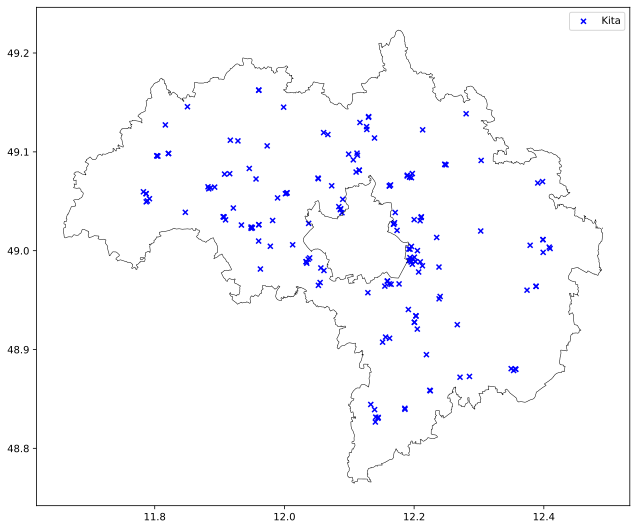
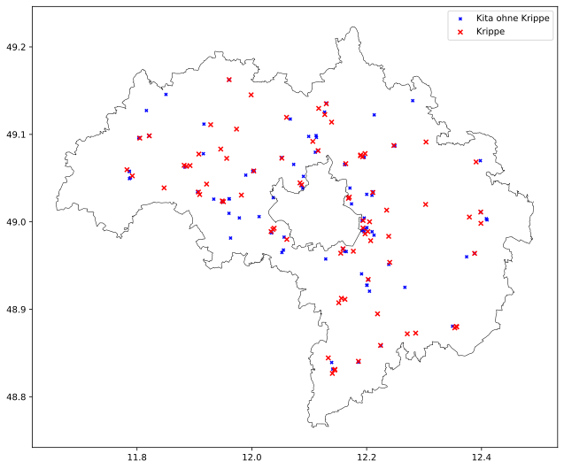
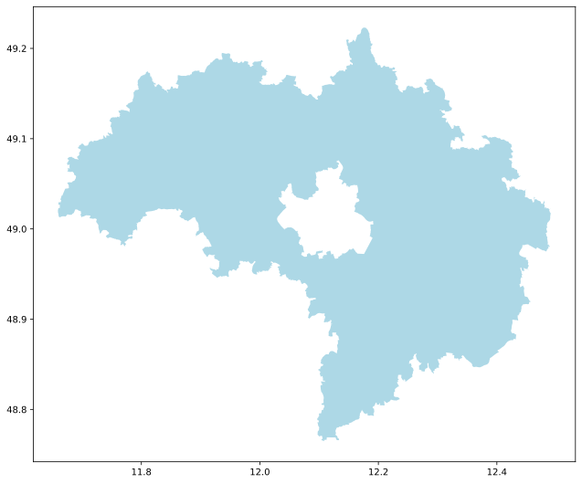

## Open Data - Kita-Beispiel

### Mit Daten aus dem Landkreis Regensburg

#### Kindertageseinrichtungen im Landkreis Regensburg

##### vom 31.01.2026

Datenbereitsteller Landkreis Regensburg<sup>*</sup>
*<sub>https://lk-regensburg.bydata.de/datasets/https-lk-regensburg-bydata-de-dataset-kindertagesbetreuung~~1?locale=de</sub>

Kartendaten OpenStreetMap Contributers und Python Bibliothek OSMnx<sup>*</sup>

*<sub>Boeing, G. 2025. Modeling and Analyzing Urban Networks and Amenities with OSMnx. Geographical Analysis, published online ahead of print. doi:10.1111/gean.70009</sub>

Importierte Bibliotheken:
```python
import osmnx as ox
import pandas as pd
import geopandas as gpd
import matplotlib.pyplot as plt
```

Kartendaten laden:

```python
lkr = ox.geocode_to_gdf('Landkreis Regensburg, Bavaria, Germany')
```

Standorte der Kindertageseinrichtungen im Landkreis Regensburg aus GeoJson des Landkreis entnehmen:

```python
kitas = gpd.read_file('items.json')
```

Kita-Standorte auf Karte darstellen:
```python
f, ax = plt.subplots(figsize = (16, 9))
lkr.boundary.plot(ax=ax, color = boundary_color, linewidth = 0.5)
kitas.plot(ax = ax, marker= 'x', markersize= 25, color = marker_kita_color, label = 'Kita')
ax.legend()
plt.show()
```
Output:


Kind im Beispiel unter drei Jahre alt, daher werden nur Kitas mit Option "Krippe" berücksichtigt.

``` python
krippen = kitas[(kitas['krippe'] == True)]
kitas_ohne_krippe = kitas[(kitas['krippe'] == False)]
```
Neue Karte mit farbig markierten Krippen-Standorten:
```python
f, ax = plt.subplots(figsize = (16, 9))
lkr.boundary.plot(ax=ax, color = boundary_color, linewidth = 0.5)
kitas_ohne_krippe.plot(ax = ax, marker= 'x', markersize= 10, color = marker_kita_color, label='Kita ohne Krippe')
krippen.plot(ax = ax, marker= 'x', markersize= 25, color = marker_krippe_color, label = 'Krippe')
ax.legend()
plt.show()
```
Output:


Kind soll im Beispiel in der Gemeinde Beratzhausen betreut werden.

```python
beratzhausen_geocode = 'Beratzhausen, Landkreis Regensburg, Bavaria, 93176, Germany'
beratzhausen = ox.geocode_to_gdf(beratzhausen_geocode) #geodataframe Gemeinde Beratzhausen
```
Mehr Details zu Gemeinde Beratzhausen hinzufügen:
```python
beratz_buildings = ox.features.features_from_place(beratzhausen_geocode, {"building": True})
beratz_landuse = ox.features.features_from_place(beratzhausen_geocode, {"landuse": True})
beratz_streets = ox.features.features_from_place(beratzhausen_geocode, {"highway": True})
beratz_water = ox.features.features_from_place(beratzhausen_geocode, {"water": True, "waterway": True, "natural": "water"})
```
Karte von Beratzhausen mit Kita-Standorten und Details darstellen:
```python
f, ax = plt.subplots(figsize = (16, 9))
beratzhausen.boundary.plot(ax = ax, color = boundary_color, linewidth = 0.5)
beratz_landuse.plot(ax = ax, color = landuse_color, alpha = 0.35)
beratz_water.plot(ax = ax, color = water_color, alpha = 0.35)
beratz_buildings.plot(ax = ax, color = buildings_color, alpha = 0.6)
kitas_beratzhausen.plot(ax = ax, marker= 'x', markersize= 25, color = marker_kita_color, label = 'Kita')
ax.legend()
plt.show()
```
Output:


Kinder weiterhin unter 3 Jahren, daher erneut Standorte mit Option "Krippe":

```python
krippen_beratzhausen = kitas_beratzhausen[(kitas_beratzhausen['krippe'] == True)]
kitas_ohne_krippe_beratzhausen = kitas_beratzhausen[(kitas['krippe'] == False)]
```
Karte von Beratzhausen mit Details und Kitas bzw. Krippen darstellen:

```python
f, ax = plt.subplots(figsize = (16, 9))
beratzhausen.boundary.plot(ax = ax, color = boundary_color, linewidth = 0.5)
beratz_landuse.plot(ax = ax, color = landuse_color, alpha = 0.35)
beratz_water.plot(ax = ax, color = water_color, alpha = 0.35)
beratz_buildings.plot(ax = ax, color = buildings_color, alpha = 0.6)
kitas_ohne_krippe_beratzhausen.plot(ax = ax, marker= 'x', markersize= 30, color = marker_kita_color, label='Kitas ohne Krippe')
krippen_beratzhausen.plot(ax = ax, marker= 'x', markersize= 30, color = marker_krippe_color, label='Krippen')
ax.legend()
plt.show()
```

Namen der Krippen sollen angezeigt werden:

```python
for x, y, label in zip(krippen_beratzhausen.geometry.x, krippen_beratzhausen.geometry.y, krippen_beratzhausen.name):
    ax.annotate(label, xy=(x, y), xytext=(3, 3), textcoords="offset points", color = 'black', fontsize = 10)
```

Output:


Kartenausschnitt mit Krippen in höherer Auflösung
```python
xmin, ymin, xmax, ymax = krippen_beratzhausen.total_bounds
dx = xmax - xmin
dy = ymax - ymin
ax.set_xlim(xmin - 0.5*dx, xmax + 0.5*dx)
ax.set_ylim(ymin - 0.5*dy, ymax + 0.5*dy)
```

Straßen hinzufügen
```python
beratz_streets.plot(ax = ax, color = street_color, linewidth = 0.5)
```
Output:


Jetzt hat das Kind aus dem Beispiel die Wahl zwischen zwei Krippen.

#### Der nächste Karteneintrag

Die Daten für das Stadtgebiet Regensburg möchte ich gerne in der ausgeschriebenen Position vervollständigen.



